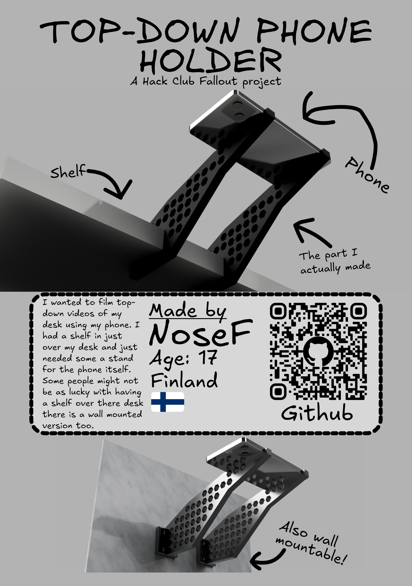

# TopDown-Phone-Holder

It's a simple personal project made just to hold my phone and film top down timelapses. I have a shelf in my room mounted above my desk and I made a simple holder that clamps to the shelf and holds the phone at the right angle. I also made a wall mountable version to be used else where and as a learning project. Even though this project was made mostly for me it could be replicated and used by anyone even for a different use case since this is pretty much just a simple holder for anything. 

## Assembly / Build guide

You should start off with picking the option you want to use. Either the wall mounted version or if you happen to have a shelf the shelf mountable option. You will probably have to edit the size of the shelf. You can do this in Fusion by importing the project changing the sketch that defines the default is 24.90 mm which works for well for my 25mm shelf.

After getting or editing the files to get the right 3d file you can print it. My phone (Iphone 13) can stay up with only one of the holders in the middle but you should probably use 2 just to make sure the phone doesn't tilt and fall.

If you have a 3d printer like I have you can just print this yourself. If not you can use a service like JLC3DP for printing this. You can see in the [BOM.csv](.) the price it would have cost me if I had used a service like this. You may also want to consider checking if there is a public makerspace or library that has a public 3D printer you can use.

After printing it's just as simple as mounting the holder and placing the phone on the holder. If you want to connect your phone to a computer and OBS you can check the next section

## Software

For connecting your phone to a computer for recording top down videos with OBS there are many options. I decided to use [Camo camera](https://camo.com/camera) since it seemed to work well on iOS and was free. You can also use it on android. After installing the Camo app on both my phone and my PC I could use a lighting cable to connect my phone to the pc and open the camo app on both devices. After going through the setup process the phones camera showed up on my PC. Now I could use it as a camera source like any other web cam and could add it as a source in OBS. Now I can record my screen and a top down POV at the same time!

If you don't need to connect to a computer you can just use the timelapse option in your phones camera app.

## Why this was made?

So this project was made because I wanted a top down point of view for when I'm working on something and need to either show it to my friends in Discord or for when I needed to record what I was doing. I thought that this was a good opportunity to learn some more CAD while at the same time making something that I will actually use. You may be asking why not just use any other hook or holder like thing to keep the phone there. Well I had a shelf already wall mounted at the perfect height but I needed my phone to be further over the desk. So I decided to make something that attaches to the shelf and extends the reach. It also doesn't look too bad either while keeping the phone perfectly steady

## Zine page

For Fallout I was required to make a Zine page of this project. Here it is!

## Acknowledgements

This was a project made for [Hack Club Fallout](fallout.hackclub.com). It was a project first meant only for personal use but then kind of expanded upon to make it more of a full project. This was one of my first projects for Fallout.
